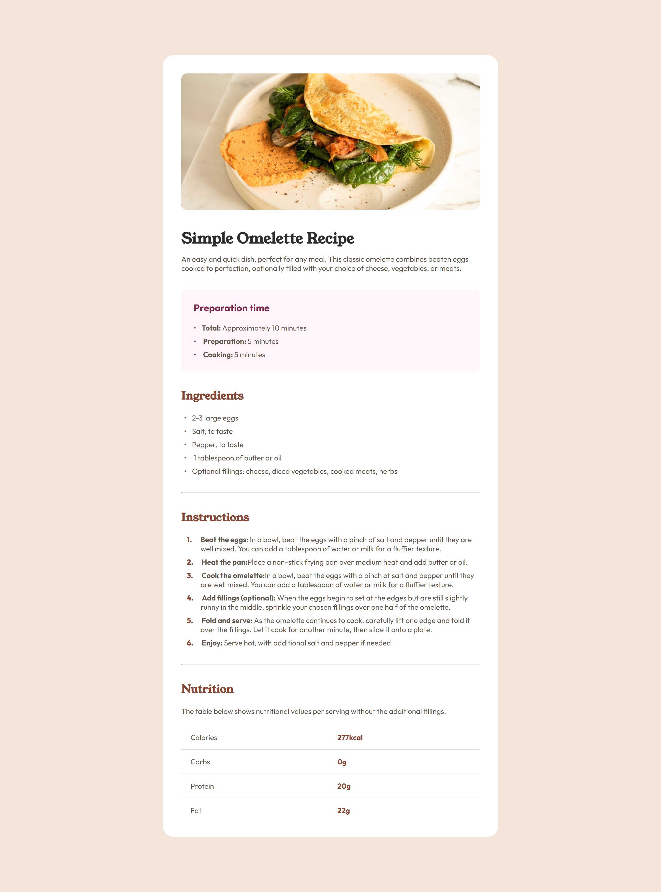

# Frontend Mentor - Recipe page solution

This is a solution to the [Recipe page challenge on Frontend Mentor](https://www.frontendmentor.io/challenges/recipe-page-KiTsR8QQKm). Frontend Mentor challenges help you improve your coding skills by building realistic projects. 

## Table of contents

- [Overview](#overview)
  - [Screenshot](#screenshot)
  - [Links](#links)
- [My process](#my-process)
  - [Built with](#built-with)
  - [What I learned](#what-i-learned)
  - [Continued development](#continued-development)
- [Author](#author)

## Overview

### Screenshot




### Links

- [Solution URL](https://github.com/vi-almeida-design/recipe-page)
- [Live Site URL](https://vi-almeida-design.github.io/recipe-page/)

## My process

### Built with

- HTML5
- CSS3
- VSCode


### What I learned

This challenge was very difficult and tried a lot of things out for the first time:

- Writting HTML tables and styling them with CSS;
- Used ````ol```` for the first time;
- Kinda learned how to style ````li```` markers, albeit with a lot of difficulty and with a solution that I wasn't completely happy with;

### Continued development

I want to improve my code for Ordered and Unordered lists and styling them with CSS. My solution was messy and I wasn't able to indent the ````li```` markers like I wanted to.


## Author

- Website - [vi-almeida-design](https://github.com/vi-almeida-design)
- Frontend Mentor - [@vi-almeida-design](https://www.frontendmentor.io/profile/vi-almeida-design)

```
My name is Vinícius, but it might be easier to just call me Vi or Vini. I'm an undergraduate Graphic Designer.

Currently I'm dabbling into HTML/CSS on my free-time because it's genuinely fun and because it's a nice skill to have since I want to be able to work on Web-Design (although I'm more than aware that it's not a requirement in the slightest).
```
